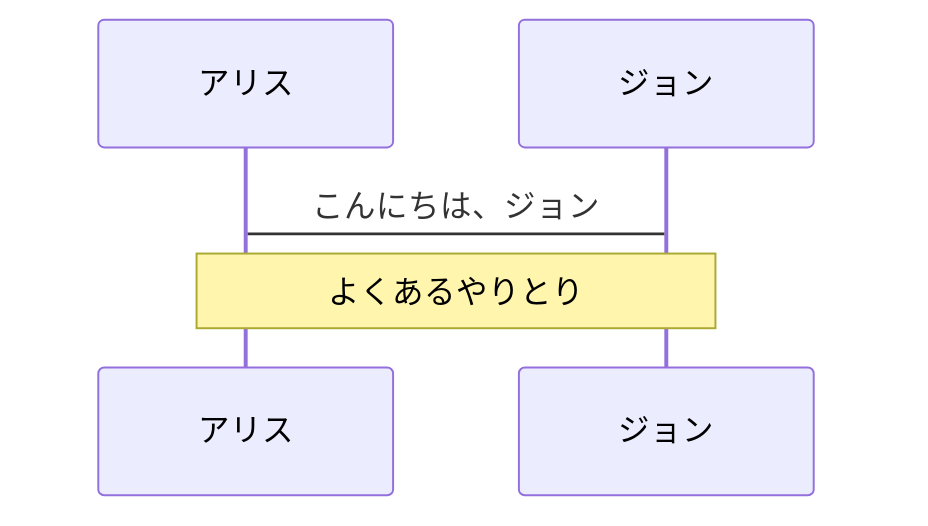
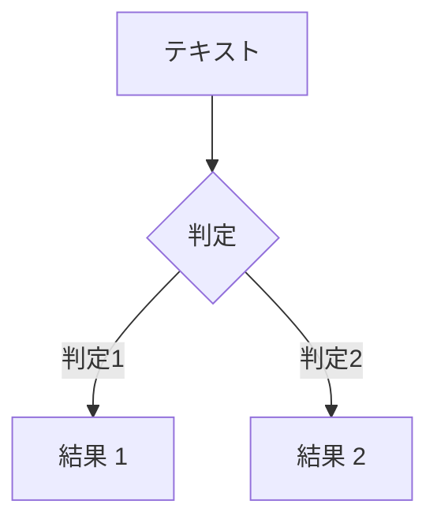
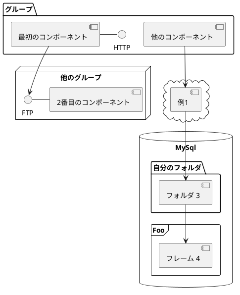

---
# try also 'default' to start simple
theme: seriph
# random image from a curated Unsplash collection by Anthony
# like them? see https://unsplash.com/collections/94734566/slidev
background: https://source.unsplash.com/collection/94734566/1920x1080
# apply any windi css classes to the current slide
class: 'text-center'
# https://sli.dev/custom/highlighters.html
highlighter: shiki
# show line numbers in code blocks
lineNumbers: false
# some information about the slides, markdown enabled
info: |
  ## Slidev Starter Template
  Presentation slides for developers.

  Learn more at [Sli.dev](https://sli.dev)
# persist drawings in exports and build
drawings:
  persist: false
# use UnoCSS
css: unocss
---

# Slidevでスライドを作ろう

開発者のためのプレゼン、スライド作成ツール

~ Lightning Talk 12/1 ~

<!--
The last comment block of each slide will be treated as slide notes. It will be visible and editable in Presenter Mode along with the slide. [Read more in the docs](https://sli.dev/guide/syntax.html#notes)
-->

---

# Slidevとは？

Slidevとは開発者のために作られたスライド作成、プレゼンテーションのためのツールです。以下のような特徴があります。

- 📝 **テキストベース** - マークダウンで書くことができ、スタイルもマークダウンによる記述で制御できます。
- 🎨 **テーマが使える** - テーマを作ってシェア、npmで配布することができ、多くのテーマが配布されています。
- 🧑‍💻 **開発者目線** - シンタックスハイライトが自動でついたり、コードの補完を効かせたりすることができます。
- 🤹 **動的なコンポーネントの埋め込み** - Vueのコンポーネントを埋め込むことができます。
- 🎥 **録画が可能、カメラも使用可** - デフォルトで録画できたり、インカメラをうつしたりすることができます。
- 📤 **様々な形式で出力可能** - PDFやPNGで出力できることはもちろん、SPAのアプリケーションとして動かすこともできます。
- 🛠 **カスタマイズ可能** - Webの技術でできることであればカスタマイズ可能です。


<!--
You can have `style` tag in markdown to override the style for the current page.
Learn more: https://sli.dev/guide/syntax#embedded-styles
-->

<style>
h1 {
  background-color: #2B90B6;
  background-image: linear-gradient(45deg, #4EC5D4 10%, #146b8c 20%);
  background-size: 100%;
  -webkit-background-clip: text;
  -moz-background-clip: text;
  -webkit-text-fill-color: transparent;
  -moz-text-fill-color: transparent;
}
</style>

<!--
Here is another comment.
-->

---

# ナビゲーション

左下の端をホバーするとコントロールパネルが表示されます。 [詳しくはこちら](https://sli.dev/guide/navigation.html)

### ショートカットキー

|     |     |
| --- | --- |
| <kbd>right</kbd> / <kbd>space</kbd>| 次のアニメーションorスライド |
| <kbd>left</kbd>  / <kbd>shift</kbd><kbd>space</kbd> | 前のアニメーションorスライド |
| <kbd>up</kbd> | 前のスライド |
| <kbd>down</kbd> | 次のスライド |

<!-- https://sli.dev/guide/animations.html#click-animations -->

<p v-after class="absolute bottom-23 left-45 opacity-30 transform -rotate-10">ここ!</p>

---
layout: image-right
image: https://source.unsplash.com/collection/94734566/1920x1080
---

# コード

シンタックスハイライトがデフォルトで使えます。[^1]

```ts {all|2|1-6|9|all}
interface User {
  id: number
  firstName: string
  lastName: string
  role: string
}

function updateUser(id: number, update: User) {
  const user = getUser(id)
  const newUser = { ...user, ...update }
  saveUser(id, newUser)
}
```

<arrow v-click="3" x1="400" y1="420" x2="230" y2="330" color="#564" width="3" arrowSize="1" />

[^1]: [詳しくはこちら](https://sli.dev/guide/syntax.html#line-highlighting)

<style>
.footnotes-sep {
  @apply mt-20 opacity-10;
}
.footnotes {
  @apply text-sm opacity-75;
}
.footnote-backref {
  display: none;
}
</style>

---

# Vueコンポーネント

<div grid="~ cols-2 gap-4">
<div>

Vueのコンポーネントをスライドの中で直接使うことができます。

```html
<Counter :count="10" />
```

<!-- ./components/Counter.vue -->
<Counter :count="10" m="t-4" />

[詳しくはこちら](https://sli.dev/builtin/components.html)

</div>
<div>

```html
<Tweet id="1390115482657726468" />
```

<Tweet id="1390115482657726468" scale="0.65" />

</div>
</div>

<!--
Presenter note with **bold**, *italic*, and ~~striked~~ text.

Also, HTML elements are valid:
<div class="flex w-full">
  <span style="flex-grow: 1;">Left content</span>
  <span>Right content</span>
</div>
-->


---
class: px-20
---

# テーマ

Slidevでは多様なテーマをサポートしています。細かい見た目やレイアウト、さらには、ツールの設定まで、細かくテーマで設定することができます。フロントマッターの1行編集するだけで、テーマを変更することができます。

<div grid="~ cols-2 gap-2" m="-t-2">

```yaml
---
theme: default
---
```

```yaml
---
theme: seriph
---
```


</div>

詳しい使い方は[こちら](https://sli.dev/themes/use.html)
　他のテーマは[こちら](https://sli.dev/themes/gallery.html)

---
preload: false
---

# アニメーション

[@vueuse/motion](https://motion.vueuse.org/)によってアニメーションは作られています。

```html
<div
  v-motion
  :initial="{ x: -80 }"
  :enter="{ x: 0 }">
  Slidev
</div>
```

<div class="w-60 relative mt-6">
  <div class="relative w-40 h-40">
    
    
    
  </div>

  <div
    class="text-5xl absolute top-14 left-40 text-[#2B90B6] -z-1"
    v-motion
    :initial="{ x: -80, opacity: 0}"
    :enter="{ x: 0, opacity: 1, transition: { delay: 2000, duration: 1000 } }">
    Slidev
  </div>
</div>

<!-- vue script setup scripts can be directly used in markdown, and will only affects current page -->
<script setup lang="ts">
const final = {
  x: 0,
  y: 0,
  rotate: 0,
  scale: 1,
  transition: {
    type: 'spring',
    damping: 10,
    stiffness: 20,
    mass: 2
  }
}
</script>

<div
  v-motion
  :initial="{ x:35, y: 40, opacity: 0}"
  :enter="{ y: 0, opacity: 1, transition: { delay: 3500 } }">

[詳しくはこちら](https://sli.dev/guide/animations.html#motion)

</div>

---

# LaTeX

数式などを表示できるLaTeXは[KaTeX](https://katex.org/)というライブラリでサポートされています。

<br>

Inline $\sqrt{3x-1}+(1+x)^2$

Block
$$
\begin{array}{c}

\nabla \times \vec{\mathbf{B}} -\, \frac1c\, \frac{\partial\vec{\mathbf{E}}}{\partial t} &
= \frac{4\pi}{c}\vec{\mathbf{j}}    \nabla \cdot \vec{\mathbf{E}} & = 4 \pi \rho \\

\nabla \times \vec{\mathbf{E}}\, +\, \frac1c\, \frac{\partial\vec{\mathbf{B}}}{\partial t} & = \vec{\mathbf{0}} \\

\nabla \cdot \vec{\mathbf{B}} & = 0

\end{array}
$$

<br>

[詳しくはこちら](https://sli.dev/guide/syntax#latex)

---

# 図表、図形、グラフ

図表、図形、グラフもmermaidという記法を使うことでマークダウンのテキスト形式で表すことができます。

<div class="grid grid-cols-3 gap-10 pt-4 -mb-6">







</div>

[詳しくはこちら](https://sli.dev/guide/syntax.html#diagrams)

---
src: ./pages/multiple-entries.md
hide: false
---

---
layout: center
class: text-center
---

# さらに詳しくは...

[ドキュメント](https://sli.dev) · [GitHub](https://github.com/slidevjs/slidev) · [ショーケース](https://sli.dev/showcases.html)
